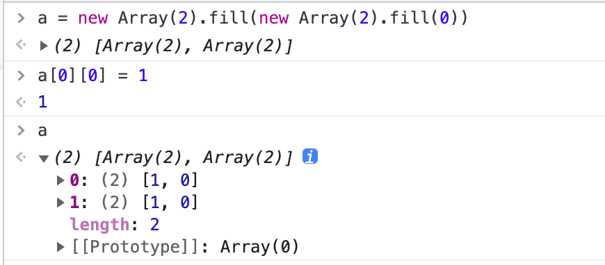
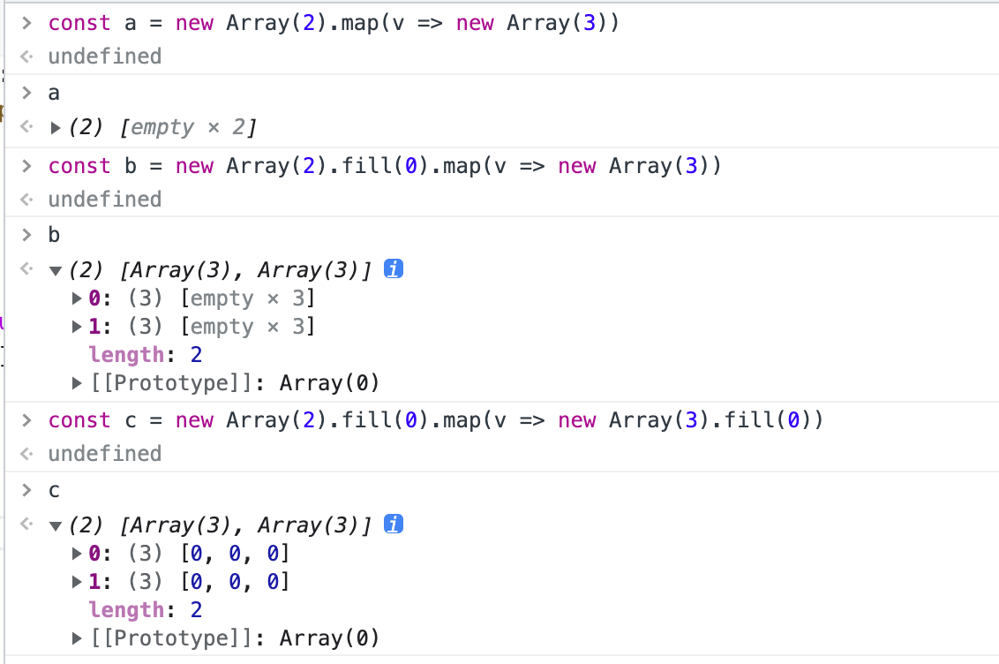
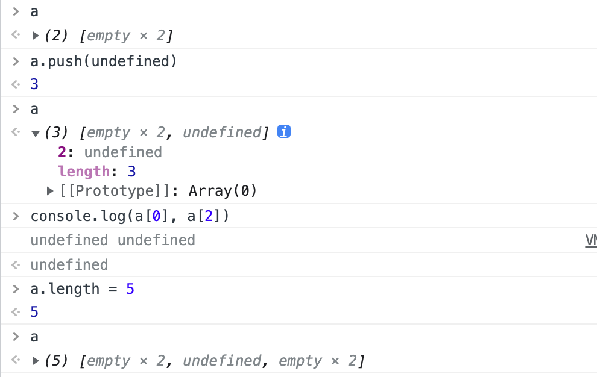

# Leetcode Practice

## 简单思路

### 1.两数之和

1. 排序后头尾双指针：比较麻烦（需要记住原下标），复杂度为排序主导
2. HashMap 模拟

### 2. 两数相加

1. 链表直接模拟
2. 数据很小，但是能不递归还是不递归，防止爆栈

### 636. 函数的独占时间

数据结构，栈模拟

### 761. 特殊的二进制序列

简单分析：

1. 序列长度必为偶数 （任意操作不会改变），必然是 1 开头
2. “任意次数操作后”：意味着结果唯一（过程可能不唯一）
3. 字典序最大：要把 1 尽可能往前放
4. 注意子串也要符合条件
5. 因为是连续子串，只要后面的子串字典序比前面大，交换后`S`必定更大
6. 2 个合法子串无论怎么拼起来都是合法的（交换后不影响合法）
7. 衍生 6: S 中 2 个合法子串 S1 和 S2 交换后，S 仍然合法

### 1114. 按序打印

简单说：保证多线程中 2 个方法的执行顺序。基本思路：

1. Mutex 互斥锁
2. Semaphore
3. Atomic 变量 + busy waiting
4. Guarded block

看起来对性能没啥要求，可以用 3 简单过。
但是实际最好减少 busy waiting，尤其是如果 waiting 时还需要频繁读取。
可以用 wait/notify 优化。题解中有看到 Thread.sleep 降频的，实际会造成性能问题。

### 22. 括号生成

假设 f(n)为所有 n 对括号的有效组合，则 f(n)的可能构成为：

1. f(i) + f(n-i) (i=1,2,...,n-1)
2. (n-i)个左括号 + f(i) + (n-i)个右括号

### 1640. 能否连接形成数组

没想出啥好办法，爆搜（但是智能一点）：

1. 用一个 dict 统计下每个小数组的头，这样匹配的时候可以迅速找到所有可能性
2. DFS 提前返回剪枝

代码写的很屎，但是 TS，所以不想改了。

补充：漏看了“元素各不相同”，其实可以写的很简单，结果写成重复元素也可以过了。

### 1302. 层数最深叶子节点的和

DFS 遍历树，记录 sum 和最大深度 maxDep：

1. 如果当前深度大于 maxDep，则到了更深的一层，更新 sum 为这个节点的 value
2. 如果当前深度等于 maxDep，则在同一层，加上 sum

其实 BFS 更整洁，因为考虑到深度，BFS 最后入队的元素一定是叶子结点，且队列中深度递增。
（这居然是中等）

### 70. 爬楼梯

经典，无须多言

### 55. 跳跃游戏

模拟从头开始，记录可以到达的最远位置（用 i + nums[i]来更新）。如果模拟中途停止，说明不可到达终点。

### 1652. 拆炸弹

滑动窗口 or 前缀和
理应优化至 O(n)

### 45. 跳跃游戏 II

p55 的变种，终于是真的 DP 了。
在位置 i 的最少次数可以由以下状态转移方程得出：

$$
f(i) = min(f(i), f(j) + 1), j + nums[j] \geq i
$$

### 788. 旋转数字

简单模拟。可以数位 DP 但是好烦。

### 32. 最长有效括号

- 有效子串：对于每个位置，从开头到该位置（包含）的左括号数量应该总是大于等于后括号数量
- 可以证明 2 个有效子串不会重叠，只能包含（或者说如果重叠，必然组成一个更大的有效子串）

写的有点慢（近似 n^2 但是也过了，感谢 leetcode）
正确做法是 DP 或者栈

### 62. 不同路径

经典题。

$$
f(i, j) = f(i-1, j) + f(i, j-1) \\
f(1, 1) = 1
$$

到达任意一个位置的可能路径为：从左边往右一格和从上面往下一格，因此只需要把两者的可能性相加。
注意循环的顺序，从上到下，从左到右。

## 注意点&小技巧

### JS/TS 生成二维数组

JS/TS 总是充满了各种陷阱。某些在其他语言如吃饭喝水一样的问题，也会在 JS 中脱胎换骨，变成一道值得探讨的面试题。

请观察以下代码:

我们发现，虽然看似成功捏出了一个二维数组，实际上所有的子数组都是一个对象。这其实不能全怪 JS，因为 python 也有类似的问题。

解决方法很简单，我们用 map 来生成就可以了。由于 fill 函数只接受 value，我们还是需要 map 函数来接受一个生成新数组的函数，以保证每次的子数组是一个新对象。

而上图在用 map 生成数组的过程中，仍然有一些小陷阱。比如刚 new 出来的数组里面并不是真的有元素（像其他语言会有默认值占位），而只是把 length 设置了一下。

由此可以顺道说一下 JS 神奇的数组（JS 的数组（Array）长久以来饱受诟病）。初学者看到上图中的种种操作想必一头雾水，这主要由于 JS 中的数组并非是其他语言中的经典数据结构。

JS 中的 Array 更像是一个修饰过的 object，而非 C/C++中一眼可以看得到内存地址的那种数组。从这个角度来说，JS 数组的地位更像是 C++中的 vector，不同点是 vector 是用心写的。

我们说 JS 数组是一个 object，是因为`typeof`数组的返回值就是 object。它的`length`属性可以随意修改，而不需要和其中的元素有任何强联系。当你获取一个下标范围以外的元素，JS 不会报错而是返回 undefined。当你设置一个下标范围以外的元素，JS 会忠实的完成操作，并且将`length`修改到这么大（但是断代的元素依然是 empty）。当你想要用除了整数以外的下标访问时，它的表现和一个 object 或者 dict 没什么不同。
